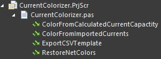
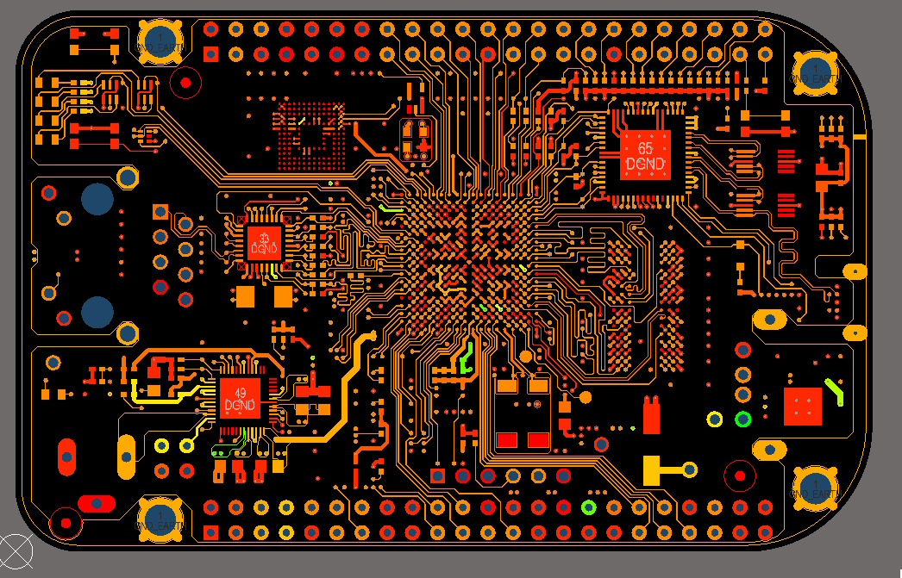

# How to Run

1. `ColorFromImportedCurrents`: 
- Export a CSV template (`ExportCSVTemplate`)
- Add your currents for any high current nets (you can leave the others blank)
- Run `ColorFromImportedCurrents`

OR

2. `ColorFromCalculatedCurrentCapactity`:
The script will prompt the user to do the following:
- Type in temperature rise in degrees Celsius
- Color nets based on current carrying capacity. Red (low current carrying capacity), Yellow (medium), Green (High)
- Export a CSV with the minimum current capacities. Min(All multilayer connected track/arcs)

<figure>
  

    
    
  

  <figcaption>Figure 1: Before and After Comparison</figcaption>
</figure>

3. `RestoreNetColors`: If an OriginalNetColors.csv exists in the script directory (it should autogenerate when running 1. or 2.), then it will import those colors.

# References
- Used Current Calculator script by John Michael Go-Soco (ETL Systems Ltd)
- Used the SelectBadConnections script by Petar Perisin as a reference to walk tracks
- Get scripts' project path from Jeff Collins and William Kitchen's stripped down version

# TODO
- Add polygon objects when walking connected tracks
- Use polygon area to find pinch points in polygons